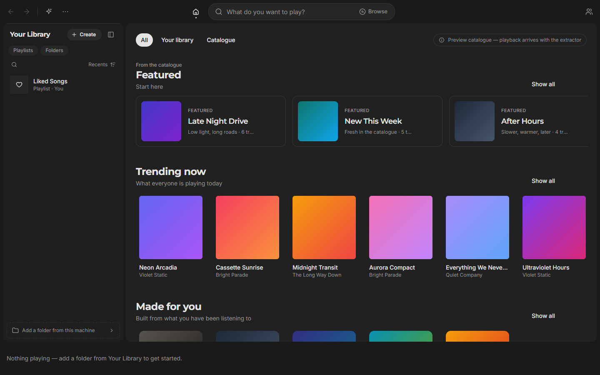

<div align="center">

# MadMusic

**One music library, every device.**

A desktop music player that plays your own files and a streaming catalogue
side by side, with the same library, queue, and playlists on every machine you
sign in to.

[](https://tauri.app)
[](https://react.dev)
[](https://www.typescriptlang.org)
[](https://www.rust-lang.org)
[](https://tailwindcss.com)
[](https://github.com/MadBlast0/MadMusic/actions/workflows/verify.yml)
[](#requirements)
[](LICENSE)



</div>

> **Status: pre-alpha.** The desktop app runs end to end on Windows, and the
> macOS and Linux builds are produced by the release workflow but not yet
> exercised by hand. Mobile is on the roadmap, not in the tree. See
> [docs/roadmap.md](docs/roadmap.md) for what is decided and what is open.

> **Private and proprietary.** See [LICENSE](LICENSE). This is not open source
> today; it may be relicensed later.

## What it does

- **Your files and a catalogue in one place.** Add a folder and the library
  reads its tags, artwork, and lyrics. Search the streaming catalogue and the
  results sit beside your own tracks, in the same queue.
- **A real player.** Gapless playback, crossfade, a ten-band equaliser with
  presets, loudness normalisation, output device selection, and a native audio
  path that hands samples to the device at the file's own rate.
- **Lyrics that follow the song.** Four lyric providers asked at once and
  ranked against each other, so the highlight follows the singer word by word
  rather than line by line, with romanisation for scripts you cannot read.
- **A library you can shape.** Playlists you drag into order, sort and filter,
  with liked songs, ratings, tags, listening history, and statistics.
- **Sign in once.** Clerk authentication, and playback state that follows an
  account across its devices, so the desktop at home can hand the queue to the
  laptop on the train.
- **At home on the desktop.** Media keys, the system tray, taskbar controls,
  a jump list, Discord presence, Last.fm scrobbling, global hotkeys, a mini
  player, picture-in-picture, and DLNA casting.
- **Two-axis theming** — light or dark, and a palette on top — with a motion
  system that respects reduced-motion settings.

## Stack

| Layer    | Choice                                                                                      |
| -------- | ------------------------------------------------------------------------------------------- |
| Shell    | **Tauri v2** — a thin Rust layer for what the webview cannot do: OS APIs, audio, filesystem |
| Frontend | **React 19**, TypeScript (strict), Vite 8, package-managed with pnpm                        |
| UI       | **Tailwind v4** + shadcn/ui primitives on Radix, `motion` for animation                     |
| Data     | SQLite (bundled, FTS5) for the local index; **Convex** for the account-level sync backend   |
| Auth     | **Clerk** — email, Google, passkeys, TOTP                                                   |
| Audio    | `cpal` + `rodio` on the native path, the Web Audio graph in the webview                     |
| Tooling  | ESLint, Prettier, Vitest, Clippy, rustfmt, absolute `@/*` imports                           |

"Thin" is the design goal for the Rust layer, not an accident. Anything that
does not need OS access belongs in the frontend.

## Requirements

| Tool    | Version                                                        |
| ------- | -------------------------------------------------------------- |
| Node.js | `^20.19.0 \|\| ^22.13.0 \|\| >=24.0.0` (see [.nvmrc](.nvmrc))  |
| pnpm    | `>=11` — enable with `corepack enable`                         |
| Rust    | stable, via [rustup](https://rustup.rs), for the desktop shell |

pnpm is mandatory. npm and yarn will produce a lockfile this project does not
track and will bypass the supply-chain policy in
[pnpm-workspace.yaml](pnpm-workspace.yaml).

On Windows the Rust build also needs `rc.exe` from the Windows SDK on `PATH`.
[CONTRIBUTING.md](CONTRIBUTING.md#windows-prerequisite-rcexe) explains the
error it produces when missing and how to fix it.

## Getting started

```bash
corepack enable
pnpm install
cp .env.example .env.local   # Windows: copy .env.example .env.local
pnpm extractor               # fetch the yt-dlp sidecar for this machine
pnpm app                     # the desktop app, with hot reload
```

`pnpm dev` runs the frontend alone in a browser, which is enough for most UI
work. Only variables prefixed `VITE_` reach the client bundle — never put a
secret in one.

## Everyday commands

| Command                             | What it does                                                       |
| ----------------------------------- | ------------------------------------------------------------------ |
| `pnpm app`                          | Run the desktop app in development mode                            |
| `pnpm dev`                          | Run the frontend alone, in the browser, with HMR                   |
| `pnpm build`                        | Type-check the project references, then produce a production build |
| `pnpm app:build`                    | Build the installer for this platform                              |
| `pnpm test` / `pnpm test:rust`      | The frontend and Rust test suites                                  |
| `pnpm lint` / `pnpm lint:rust`      | ESLint; rustfmt and Clippy with warnings as errors                 |
| `pnpm format` / `pnpm format:check` | Prettier                                                           |
| `pnpm typecheck`                    | TypeScript, no emit                                                |
| `pnpm extractor`                    | Fetch or check the pinned `yt-dlp` sidecar                         |
| `pnpm attributions`                 | Regenerate the shipped licence list after a dependency change      |
| **`pnpm verify`**                   | **All of the checks, in order — run before every commit**          |

### `pnpm verify` is the gate

Format, lint, types, tests, build, Clippy, Rust tests: one command, and if it
passes locally the change is mergeable. GitHub Actions runs the same command on
every push, and the [release workflow](.github/workflows/release.yml) builds
installers for Windows, macOS, and Linux from a version tag.

## Layout

```
src/                   frontend (React) — imported as @/*
  components/          ui/ (shadcn primitives), player/, library/, layout/, home/, …
  views/               one file per screen, lazy-loaded from App.tsx
  hooks/               reusable hooks
  lib/                 the model: store, queue, audio graph, lyrics, search, sync
  test/                test setup and render helpers
src-tauri/             the Rust shell — commands, the SQLite index, audio, OS integration
convex/                the account backend: auth tickets, devices, sync, uploads
scripts/               sidecar fetching, attribution generation, packaging
design/                design canvases for the interface
docs/                  planning and engineering notes
.github/               workflows, issue and PR templates, ownership
```

## Documentation

- [CONTRIBUTING.md](CONTRIBUTING.md) — workflow, branches, commits, the Rust rules, dependency policy
- [SECURITY.md](SECURITY.md) — reporting a vulnerability
- [CODE_OF_CONDUCT.md](CODE_OF_CONDUCT.md) — expected conduct
- [docs/roadmap.md](docs/roadmap.md) — what is decided, what is open, what is built
- [docs/music-sources.md](docs/music-sources.md) — where music data comes from, and the trade-offs
- [docs/auth-and-devices.md](docs/auth-and-devices.md) — sign-in and playback across devices
- [docs/ci-plan.md](docs/ci-plan.md) — the CI and release pipeline
- [CHANGELOG.md](CHANGELOG.md) — notable changes
